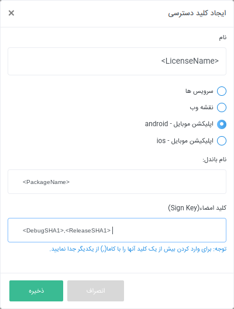

# android-neshan-maps-starter

<div dir=rtl>

در این پروژه نحوه استفاده از کلاس‌های مختلف موجود در
[پلتفرم نقشه نشان](https://platform.neshan.org/)
آموزش داده شده‌است.

توضیحات مربوط به هر یک از صفحات این اپلیکیشن در
[ویکی](https://github.com/NeshanMaps/android-neshan-maps-starter-master-new/wiki)
این پروژه موجود است.


[از اینجا شروع کنید :)](https://platform.neshan.org/sdk/android-sdk-getting-started)
  
</div>

  # Neshan Maps Android SDK

Neshan platform is providing map infrastructures. You can simply use the APIs and development kits in your [IOS](https://platform.neshan.org/sdk/ios-sdk), [Android](https://platform.neshan.org/sdk/android-sdk), [ReactJS](https://platform.neshan.org/sdk/web-sdk), [AngularJS](https://github.com/maherAshori/Neshan-Map) and [WordPress](https://platform.neshan.org/sdk/wordpress-addon) apps.

## Quickstart

First, you need to retrieve a license for using the Android SDK in your app and paste it into your project.

### 1. SHA1 Key

The SHA1 key of any sign key is unique, but there is a debug sign key in your system when you install android studio. You can use your shared debug sign key (shared between your projects), your release sign key, or both of them to use for retrieving license files from the Neshan platform website.

To do that, replace `/PATH/TO/SIGN/KEY` with the path of your sign key and `<AliasOfSignKey>` with the alias of that signing key.

* Release SHA1

```bash
#windows
keytool.exe -list -v -keystore 'PATH/TO/SIGN/KEY' -alias <AliasOfSignKey>

#Linux/Mac
keytool -list -v -keystore 'PATH/TO/SIGN/KEY' -alias <AliasOfSignKey>
```

* Debug SHA1

```bash
#windows
keytool.exe -list -v -keystore '~\.android\debug.keystore' -alias androiddebugkey -storepass android -keypass android

#Linux/Mac
keytool -list -v -keystore '~\.android\debug.keystore' -alias androiddebugkey -storepass android -keypass android
```

### 2. Reteriving License

Login to your account in [Neshan Platform](https://developers.neshan.org), then open [this page](https://developers.neshan.org/panel/access-token/index) and click on `ایجاد کلید دسترسی` button. Now you can see this modal opened for you.

You can replace `<LicenseName>` with the name that identified your license in the Neshan panel and `<PackageName>` with the package name of your android project and enter your SHA1 keys from step one in the `Sign Key` field separated with a comma (replace `<DebugSHA1>` and `<ReleaseSHA1>`).



After that, download your license and paste it into the `app/main/res/raw/` folder of your android project.

### 3. Installation

First, you need to add the Neshan Maven repository to your `build.gradle (project)`.

```groovy
allprojects {
  repositories {
    ..
    maven { url "https://maven.neshan.org/artifactory/public-maven" }
  }
}
```

Then you can add Neshan dependencies to your `build.grade (module:app)`

```groovy
dependencies {
    //Neshan sdk library
    implementation 'neshan-android-sdk:mobile-sdk:1.0.0'
    implementation 'neshan-android-sdk:services-sdk:1.0.0'
    implementation 'neshan-android-sdk:common-sdk:0.0.1'

    //Play Services
    implementation 'com.google.android.gms:play-services-gcm:16.1.0'
    implementation 'com.google.android.gms:play-services-location:17.0.0'
}
```

Make sure that you are using internet permission in your `AndroidManifest.xml` file:

```xml
<uses-permission android:name="android.permission.INTERNET"/>
```

**__Note:__** if you are using progaurd in your project, be sure that you are keeping Neshan SDK classes in your `proguard-rules.pro` file:

```
-keep class org.neshan.** {*;}
```


To reduce the final APK size you can add following lines to your `build.gradle (module:app)` file:

```groovy
android{
  ..
  ..
  splits {
    abi {
        enable true
        reset()
        include 'armeabi-v7a'
        universalApk false
    }
  }
}
```

Adding the code line above makes your APK to support mentioned architectures only. For more information about different available architectures and also more on ABI filter, you can checkout [ABI Mangement](https://developer.android.com/ndk/guides/abis) document.

### 4. Usage

Define Neshan MapView in xml:

```xml
<org.neshan.mapsdk.MapView
    android:layout_width="match_parent"
    android:layout_height="match_parent"
    android:id="@+id/map"/>
```

For more information about the usage of Neshan Map SDK, please check out the [wiki](https://github.com/NeshanMaps/android-neshan-maps-starter/wiki) page.

Please do not hesitate to [contact us](https://platform.neshan.org/contact) if you require any further assistance about using the SDK.

